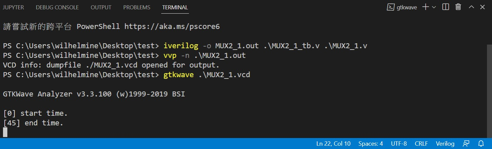
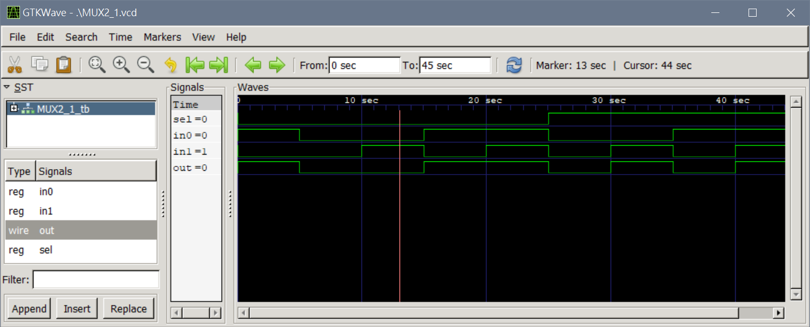

# 使用 VS code來編譯Verilog

## 1. 安裝方法(Win 10)
* [iVerilog](http://iverilog.icarus.com/): 記得加入環境變數
* [GTKWave](http://gtkwave.sourceforge.net/)
* 在VS code裡安裝 Verilog-HDL/SystemVerilog/Bluespec SystemVerilog

## 2. 編譯方法
* a. 編譯
```verilog
 iverilog -o filename.out filename_tb.v filename.v
```
* b. 生成波形檔
```verilog
vvp -n filename.out
```
* c. 打開波形檔
```verilog
gtkwave filename.vcd
```
## 測試檔
* MUX2_1.v
```verilog
module MUX2_1(out,sel,in0,in1);
  output out;
  input in0, in1, sel;

  not n1(BarSel, sel);
  and a1(n0, in0, BarSel);
  and a2(n1, in1, sel);
  or o1(out, n0, n1);
endmodule
```
* MUX2_1_tb.v
```verilog
module MUX2_1_tb;
  wire out;
  reg sel,in0,in1;
  
  MUX2_1 D0(out,sel,in0,in1);

  initial begin
    $dumpfile("./MUX2_1.vcd");  
    $dumpvars(0, MUX2_1_tb);

    in0=1;in1=0;sel=0;
    #5 in0=0;in1=0;sel=0;
    #5 in0=0;in1=1;sel=0;
    #5 in0=1;in1=0;sel=0;
    #5 in0=1;in1=1;sel=0;
    #5 in0=0;in1=0;sel=1;
    #5 in0=0;in1=1;sel=1;
    #5 in0=1;in1=0;sel=1;
    #5 in0=1;in1=1;sel=1;
    #5 $stop;
  end
endmodule
```
## Terminal實際操作

## 範例檔之波形

